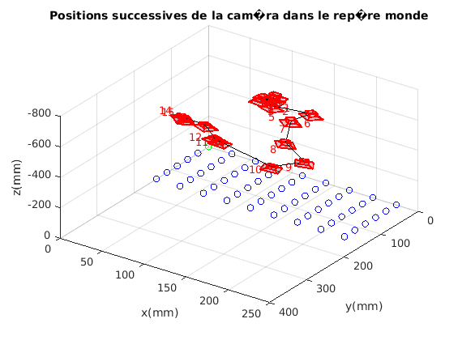

# Camera Calibration and Pose Estimation

In this project, we want to implement a method from scratch to calibrate a camera and estimate its pose. Calibration consists of finding the camera intrinsics (focal length and optical center). To do so we need to have 3-D world points and their corresponding 2-D image points. Since, we are using a chessboard, the world points are co-planar we want to find the homography between 3-D and 2-D.

We need at least 4 points to compute the homography using DLT (Direct Linear Transform). To find the best points, we use an iterative process called RANSAC. The metric used to quantify the quality of the chosen points is the reprojection error.

Finally, we can decompose the homography to retrieve the camera intrinsics and extrinsics.
## How to use

1. git clone https://github.com/StephaneSobucki/Camera-Calibration-and-Pose-Estimation.git
2. run script main.m in MATLAB

## Dependencies

Computer Vision Toolbox (to detect features and to be use plotCamera)

## Results

You can find more results in the results folder (RANSAC vs no RANSAC), if you want more details you can check the report.
